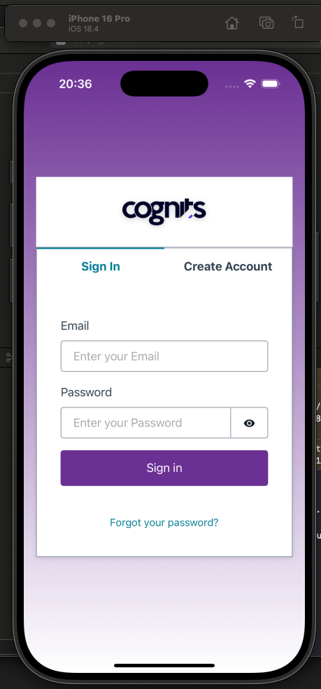
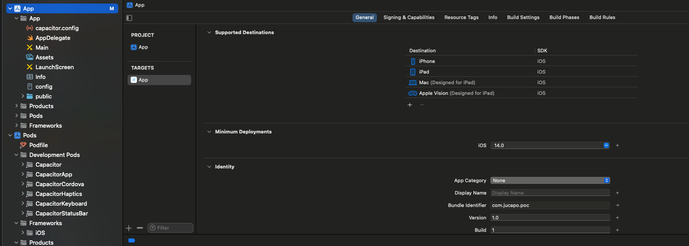

# poc-amplify-ionic

### how generate IOS compilation

#### requirements
1) install ruby - v. 3.4.3
2) install cocoapod - v. 1.16.2
3) install xcode
4) npm install -g @ionic/cli
5) install capacitor

#### how run the project to IOS
1) npm run build
2) npx cap sync ios
3) npx cap open ios *note: this open the xcode*

then, the project looks like that in xcode

after that, we could run the app in iphone emulator

#### how run the project on physics iphone device

1) connect iphone with USB cable with the computer
2) open project with xcode
3) click in project (App)

you will see this

4) click in *Signing & Capabilities*
5) in the Team option, add you apple account *note: to generate .ipa you required pay apple account*
6) in the Bundle Identifier option, must be unique; for example: choose your domain

after that, your configuration would be seen like that

7) choose you iphone device to test

8) click in *run*

9) in your phone required enable *developer mode*

   * Settings 
   * Privacy & Security

10) in your phone required trust in the developer

  * General
  * VPN & Device Management
  * Trust in the developer

